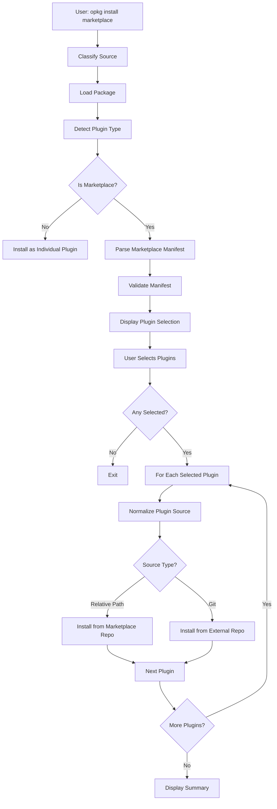

# Marketplace Installation

> Detailed specification for Claude Code plugin marketplace installation, parsing, validation, and multi-plugin installation flow.

## Overview

Plugin marketplaces are special Claude Code plugins that contain a catalog of other plugins. They enable centralized distribution and discovery of plugin collections for teams and communities.

This document specifies the complete marketplace installation workflow, from loading to installing individual plugins.

## Marketplace Manifest

### File Location

`.claude-plugin/marketplace.json` in repository root

### Schema

```typescript
interface MarketplaceManifest {
  name: string;                      // Required: marketplace identifier
  description?: string;              // Optional: marketplace description
  homepage?: string;                 // Optional: documentation URL
  plugins: MarketplacePluginEntry[]; // Required: list of plugins
}

interface MarketplacePluginEntry {
  name: string;                      // Required: plugin identifier
  source: PluginSourceSpec;          // Required: where to find plugin
  description?: string;              // Optional: plugin description
  version?: string;                  // Optional: plugin version
  author?: {
    name?: string;
    email?: string;
  };
  keywords?: string[];
  category?: string;
  strict?: boolean;
  // ... other plugin manifest fields
}

type PluginSourceSpec = string | PluginSourceObject;

type PluginSourceObject = GitHubSource | GitUrlSource;
```

### Required Fields

**Marketplace level**:
- `name`: Marketplace identifier (kebab-case recommended)
- `plugins`: Array of plugin entries (must not be empty)

**Plugin entry level**:
- `name`: Plugin identifier (kebab-case recommended)
- `source`: Where to find the plugin

### Example Manifests

#### Basic Marketplace

```json
{
  "name": "company-tools",
  "description": "Internal development tools",
  "plugins": [
    {
      "name": "code-formatter",
      "source": "./plugins/formatter",
      "description": "Automatic code formatting"
    },
    {
      "name": "deployment-tools",
      "source": {
        "source": "github",
        "repo": "company/deploy-plugin"
      },
      "description": "Deployment automation"
    }
  ]
}
```

#### Advanced Marketplace

```json
{
  "name": "enterprise-toolkit",
  "description": "Enterprise workflow automation",
  "homepage": "https://docs.company.com/toolkit",
  "plugins": [
    {
      "name": "security-scanner",
      "source": "./plugins/security",
      "description": "Security vulnerability scanner",
      "version": "2.1.0",
      "author": {
        "name": "Security Team",
        "email": "security@company.com"
      },
      "keywords": ["security", "scanning"],
      "category": "security"
    },
    {
      "name": "cloud-deploy",
      "source": {
        "source": "github",
        "repo": "company/cloud-tools",
        "ref": "v3.0.0",
        "path": "plugins/deploy"
      },
      "description": "Multi-cloud deployment tools",
      "version": "3.0.0"
    },
    {
      "name": "internal-ci",
      "source": {
        "source": "url",
        "url": "https://gitlab.company.com/platform/ci-plugin.git",
        "ref": "stable"
      },
      "description": "Internal CI/CD integration"
    }
  ]
}
```

## Installation Flow

### High-Level Process

```
1. User initiates: opkg install <marketplace-source>
2. Load marketplace repository
3. Detect marketplace type
4. Parse marketplace manifest
5. Validate manifest structure
6. Display plugin selection prompt
7. User selects plugins to install
8. Install each selected plugin
9. Display installation summary
```

### Detailed Workflow



## Marketplace Loading

### Source Classification

Marketplaces can be installed from:

```bash
# GitHub shorthand
opkg install github:company/marketplace

# Full git URL
opkg install git:https://gitlab.com/company/plugins.git

# Local path (for development)
opkg install ./local-marketplace
```

### Repository Cloning

For git sources:

1. Clone to temporary directory
2. Checkout specified ref (if provided)
3. Verify `.claude-plugin/marketplace.json` exists

```typescript
const repoPath = await cloneGitRepository(gitUrl, {
  ref: gitRef,
  depth: 1,
  tempDir: true
});

const manifestPath = join(repoPath, '.claude-plugin/marketplace.json');
if (!await exists(manifestPath)) {
  throw new Error('Not a valid marketplace');
}
```

## Manifest Parsing

### Parse Process

```typescript
async function parseMarketplace(
  manifestPath: string,
  context?: { gitUrl?: string; repoPath?: string }
): Promise<MarketplaceManifest>
```

**Steps**:

1. Read manifest file
2. Parse JSON
3. Apply fallback name from context (if needed)
4. Validate required fields
5. Validate each plugin entry
6. Normalize and validate each plugin source

### Validation Rules

#### Marketplace Validation

```typescript
// Required: name field
if (!manifest.name) {
  throw new ValidationError('Marketplace manifest missing required field: name');
}

// Required: plugins array
if (!manifest.plugins || !Array.isArray(manifest.plugins)) {
  throw new ValidationError('Marketplace manifest missing or invalid plugins array');
}

// Required: non-empty plugins
if (manifest.plugins.length === 0) {
  throw new ValidationError('Marketplace contains no plugins');
}
```

#### Plugin Entry Validation

```typescript
for (const plugin of manifest.plugins) {
  // Required: name
  if (!plugin.name) {
    throw new ValidationError('Marketplace plugin entry missing required field: name');
  }
  
  // Required: source
  if (!plugin.source) {
    throw new ValidationError(`Plugin '${plugin.name}' missing required field: source`);
  }
  
  // Validate source can be normalized
  try {
    normalizePluginSource(plugin.source, plugin.name);
  } catch (error) {
    throw new ValidationError(
      `Plugin '${plugin.name}' has invalid source: ${error.message}`
    );
  }
}
```

### Name Fallback

If marketplace name is missing, use repository name:

```typescript
if (!manifest.name && context?.repoPath) {
  manifest.name = basename(context.repoPath);
  logger.debug('Using repo name as fallback', { name: manifest.name });
}
```

## Plugin Selection

### Interactive Prompt

Display multiselect prompt with all available plugins:

```
📦 Marketplace: company-tools
   Internal development tools

5 plugins available:

  ◯ code-formatter - Automatic code formatting
  ◯ deployment-tools - Deploy to staging/production
  ◯ commit-hooks - Git commit message validation
  ◯ security-scanner - Scan for vulnerabilities
  ◯ performance-monitor - Monitor app performance

Select plugins to install (space to select, enter to confirm):
```

### Prompt Implementation

```typescript
async function promptPluginSelection(
  marketplace: MarketplaceManifest
): Promise<string[]>
```

**Features**:

1. Display marketplace name and description
2. Show plugin count
3. List all plugins with descriptions
4. Allow multi-selection with space bar
5. Require at least one selection
6. Return array of selected plugin names

**User Actions**:
- Arrow keys: Navigate
- Space: Toggle selection
- Enter: Confirm selection
- Ctrl+C: Cancel

**Return Value**:
- Array of selected plugin names
- Empty array if user cancels

## Plugin Installation

### Installation Loop

```typescript
const results: Array<{
  name: string;
  scopedName: string;
  success: boolean;
  error?: string;
}> = [];

for (const pluginName of selectedNames) {
  // 1. Find plugin entry
  const pluginEntry = marketplace.plugins.find(p => p.name === pluginName);
  
  // 2. Normalize source
  const normalizedSource = normalizePluginSource(
    pluginEntry.source,
    pluginName
  );
  
  // 3. Install based on source type
  if (isRelativePathSource(normalizedSource)) {
    result = await installRelativePathPlugin(...);
  } else if (isGitSource(normalizedSource)) {
    result = await installGitPlugin(...);
  }
  
  // 4. Track result
  results.push({ name: pluginName, success: result.success, ... });
}
```

### Relative Path Installation

For plugins in marketplace repository:

```typescript
async function installRelativePathPlugin(
  marketplaceDir: string,
  marketplace: MarketplaceManifest,
  pluginEntry: MarketplacePluginEntry,
  normalizedSource: NormalizedPluginSource,
  marketplaceGitUrl: string,
  marketplaceGitRef: string | undefined,
  options: InstallOptions
): Promise<CommandResult>
```

**Process**:

1. Resolve plugin directory path
2. Validate directory exists
3. Validate plugin manifest exists
4. Validate manifest is parseable
5. Generate scoped plugin name
6. Build git install context with subdirectory
7. Run unified installation pipeline
8. Return result

**Validation checks**:

```typescript
// Directory exists
const pluginDir = join(marketplaceDir, normalizedSource.relativePath);
if (!await exists(pluginDir)) {
  return { success: false, error: `Subdirectory does not exist` };
}

// Is valid plugin
const detection = await detectPluginType(pluginDir);
if (!detection.isPlugin || detection.type !== 'individual') {
  return { success: false, error: `Not a valid plugin` };
}

// Manifest is parseable
if (!await validatePluginManifest(detection.manifestPath)) {
  return { success: false, error: `Invalid plugin manifest` };
}
```

**Context creation**:

```typescript
const ctx = await buildGitInstallContext(
  process.cwd(),
  marketplaceGitUrl,
  {
    ...options,
    gitRef: marketplaceGitRef,
    gitSubdirectory: normalizedSource.relativePath
  }
);
```

### External Git Installation

For plugins from external repositories:

```typescript
async function installGitPlugin(
  marketplace: MarketplaceManifest,
  pluginEntry: MarketplacePluginEntry,
  normalizedSource: NormalizedPluginSource,
  options: InstallOptions
): Promise<CommandResult>
```

**Process**:

1. Extract git URL, ref, and subdirectory from normalized source
2. Generate scoped plugin name
3. Build git install context with external URL
4. Run unified installation pipeline
5. Return result

**Context creation**:

```typescript
const ctx = await buildGitInstallContext(
  process.cwd(),
  normalizedSource.gitUrl,
  {
    ...options,
    gitRef: normalizedSource.gitRef,
    gitSubdirectory: normalizedSource.gitSubdirectory
  }
);
```

### Error Handling

Each plugin installation is independent:

```typescript
try {
  const result = await installPlugin(...);
  results.push({ name, success: result.success, error: result.error });
} catch (error) {
  // Catch exceptions and continue
  results.push({
    name,
    success: false,
    error: error instanceof Error ? error.message : String(error)
  });
}
```

**Failure isolation**: One plugin failure doesn't stop others from installing.

## Installation Summary

### Display Format

After all plugins are processed, display summary:

```
============================================================
Installation Summary:
============================================================

✓ Successfully installed (3):
  • code-formatter@company-tools
  • deployment-tools@deploy-plugin
  • security-scanner@company-tools

✗ Failed to install (1):
  • broken-plugin@company-tools: subdirectory not found
```

### Implementation

```typescript
function displayInstallationSummary(
  results: Array<{
    name: string;
    scopedName: string;
    success: boolean;
    error?: string;
  }>
): void
```

**Components**:

1. Separator line (60 chars)
2. "Installation Summary" header
3. Separator line
4. Success section (if any)
   - Count of successful installations
   - List with bullet points
5. Failure section (if any)
   - Count of failed installations
   - List with bullet points and error messages
6. Empty line

### Success Criteria

Overall installation is considered successful if:
- At least one plugin installed successfully

```typescript
return {
  success: results.some(r => r.success),
  error: results.every(r => !r.success)
    ? 'Failed to install any plugins from marketplace'
    : undefined
};
```

## Source-Specific Behavior

### Relative Path Sources

**Characteristics**:
- Plugin content is in marketplace repository
- Shares same git URL and ref as marketplace
- Subdirectory specifies plugin location

**Advantages**:
- Single repository to manage
- Consistent versioning
- Faster installation (already cloned)

**Constraints**:
- Plugin must be in marketplace repo
- Cannot reference external dependencies
- Path traversal not allowed

**Use cases**:
- Tightly coupled plugin suites
- Organization-internal tools
- Version-locked plugin sets

### GitHub Sources

**Characteristics**:
- Plugin in separate GitHub repository
- Can specify branch/tag/SHA
- Can specify subdirectory within repo

**Advantages**:
- Independent versioning
- Separate maintenance
- Can reference public plugins

**Constraints**:
- Requires network access
- Authentication for private repos
- Additional clone operation

**Use cases**:
- Third-party plugins
- Cross-organization sharing
- Independent plugin versioning

### Git URL Sources

**Characteristics**:
- Plugin in any git hosting service
- Supports GitLab, Bitbucket, self-hosted
- Full git URL specification

**Advantages**:
- Hosting flexibility
- Self-hosted support
- SSH authentication support

**Constraints**:
- Must be valid git URL
- Requires network access
- Authentication varies by host

**Use cases**:
- Internal GitLab/Bitbucket hosting
- Self-hosted git servers
- Enterprise environments

## Plugin Naming in Marketplaces

### Scoped Naming

Plugins from marketplaces get scoped names:

```
{plugin-name}@{scope}
```

**Scope determination**:

1. **Relative path sources**: Use marketplace name
   ```
   code-formatter@company-tools
   ```

2. **External GitHub sources**: Use repository name
   ```
   deployment-tools@deploy-plugin
   ```

3. **External Git URL sources**: Use repository name
   ```
   ci-integration@platform-tools
   ```

### Collision Prevention

Scoped names prevent collisions:

```
# Two plugins named "formatter" from different sources
formatter@company-tools
formatter@personal-plugins
```

### Workspace Uniqueness

Within a workspace, `{name}@{scope}` must be unique:
- Same plugin from same marketplace: Not allowed
- Same plugin from different marketplaces: Allowed
- Different plugins with same name: Allowed (different scopes)

## Update and Reinstall

### Update Detection

Marketplace plugins track their source:

```yaml
# .openpackage/workspace-index.yml
packages:
  - name: "formatter@company-tools"
    version: "1.0.0"
    source:
      type: "git"
      url: "https://github.com/company/marketplace.git"
      ref: "v1.0.0"
      subdirectory: "plugins/formatter"
```

### Reinstall Process

To update plugins:

```bash
# Reinstall entire marketplace (updates all selected plugins)
opkg install github:company/marketplace

# Reinstall specific plugin
opkg install formatter@company-tools --force
```

## Error Messages

### Marketplace-Level Errors

```
❌ Not a valid marketplace
   Repository does not contain .claude-plugin/marketplace.json

❌ Invalid marketplace manifest
   Failed to parse JSON at line 5: unexpected token

❌ Marketplace manifest missing required field: name
   Add "name" field to .claude-plugin/marketplace.json

❌ Marketplace contains no plugins
   Add at least one plugin to the "plugins" array
```

### Plugin Entry Errors

```
❌ Plugin 'my-plugin' missing required field: source
   Add "source" field to plugin entry

❌ Plugin 'my-plugin' has invalid source: repo must be in 'owner/repo' format, got: 'invalid'
   Fix "repo" field format in plugin source

❌ Plugin 'my-plugin' has invalid source: has invalid Git URL: not-a-url
   Provide valid git URL in plugin source

❌ Plugin 'my-plugin' source path contains '..' which is not allowed
   Use relative path without parent directory references
```

### Installation Errors

```
❌ Plugin 'my-plugin': Subdirectory 'plugins/missing' does not exist
   Verify plugin path in marketplace repository

❌ Plugin 'my-plugin': Subdirectory does not contain a valid plugin (missing .claude-plugin/plugin.json)
   Add plugin manifest to plugin directory

❌ Plugin 'my-plugin': Invalid plugin manifest (cannot parse JSON)
   Fix JSON syntax in .claude-plugin/plugin.json

❌ Plugin 'my-plugin': Failed to clone repository
   Check network connection and repository access
```

## Testing

### Unit Tests

Test marketplace parsing:
- Valid manifests (various source types)
- Invalid manifests (missing fields, invalid sources)
- Validation errors
- Name fallback behavior

Test plugin selection:
- Display formatting
- User interaction simulation
- Cancellation handling

### Integration Tests

Test complete marketplace installation:
- Clone marketplace
- Parse manifest
- Install multiple plugins
- Verify workspace state
- Check error handling

### Example Test Cases

```typescript
// Valid marketplace with mixed sources
const manifest = {
  name: 'test-marketplace',
  plugins: [
    { name: 'local-plugin', source: './plugins/local' },
    { name: 'github-plugin', source: { source: 'github', repo: 'owner/repo' } },
    { name: 'git-plugin', source: { source: 'url', url: 'https://...' } }
  ]
};

// Invalid: missing plugin source
const invalid = {
  name: 'bad-marketplace',
  plugins: [{ name: 'plugin' }]  // Missing source
};

// Invalid: bad GitHub repo format
const invalid2 = {
  name: 'bad-marketplace',
  plugins: [{
    name: 'plugin',
    source: { source: 'github', repo: 'invalid' }
  }]
};
```

## Performance Considerations

### Optimization Strategies

1. **Shallow clones**: Use `--depth=1` for marketplace repos
2. **Parallel installation**: Install independent plugins concurrently (future)
3. **Caching**: Reuse cloned marketplaces when possible
4. **Lazy loading**: Only clone external repos when selected

### Progress Reporting

```
📦 Installing plugin: code-formatter@company-tools...
✓ Successfully installed code-formatter@company-tools

📦 Installing plugin: deployment-tools@deploy-plugin...
✓ Successfully installed deployment-tools@deploy-plugin

📦 Installing plugin: security-scanner@company-tools...
✗ Failed to install security-scanner@company-tools: subdirectory not found
```

## Security Considerations

### Source Validation

1. All sources validated before installation
2. Path traversal prevented (`..` rejected)
3. Absolute paths rejected
4. Git URLs validated

### Authentication

Private repositories supported via environment variables:
- `GITHUB_TOKEN` or `GH_TOKEN` for GitHub
- `GITLAB_TOKEN` or `GL_TOKEN` for GitLab
- `BITBUCKET_TOKEN` for Bitbucket

### Isolation

Each plugin installed independently:
- Separate content directory
- No shared state
- Failure isolation

## See Also

- [Plugin Installation](./plugin-installation.md)
- [Git Sources](./git-sources.md)
- [Plugin Source Normalization](../claude-plugins-marketplace-creation.md#plugin-sources)
- [Workspace Index](../package/package-index-yml.md)
