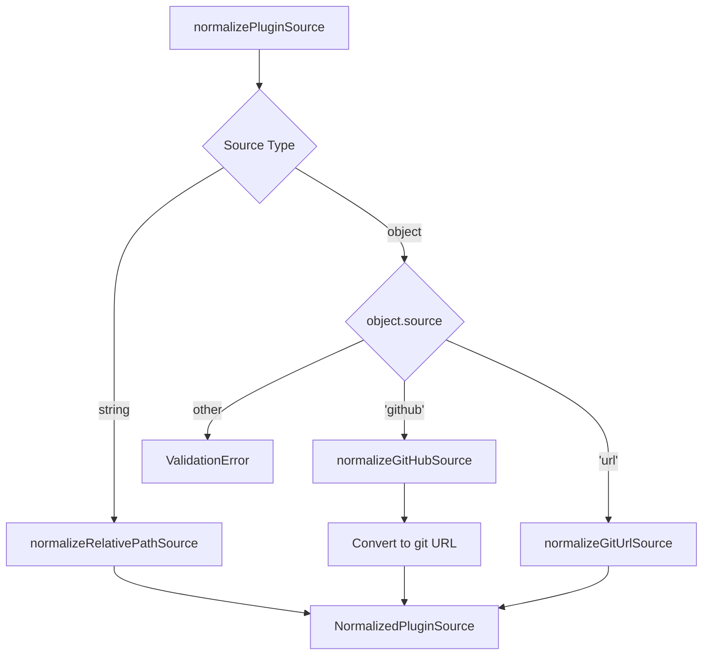

# Plugin Source Normalization

> Specification for normalizing and validating Claude Code plugin sources from marketplace manifests.

## Overview

Plugin sources in marketplace manifests can be specified in multiple formats. The normalization process converts all source types into a consistent internal format while validating correctness and security.

This document specifies the complete normalization and validation logic.

## Source Types

### Type Hierarchy

```typescript
type PluginSourceSpec = string | PluginSourceObject;

type PluginSourceObject = GitHubSource | GitUrlSource;

interface GitHubSource {
  source: 'github';
  repo: string;
  ref?: string;
  path?: string;
}

interface GitUrlSource {
  source: 'url';
  url: string;
  ref?: string;
  path?: string;
}
```

### Normalized Format

All sources are normalized to:

```typescript
interface NormalizedPluginSource {
  type: 'relative-path' | 'git';
  
  // For relative-path type
  relativePath?: string;
  
  // For git type
  gitUrl?: string;
  gitRef?: string;
  gitSubdirectory?: string;
  
  // Original source for reference
  rawSource: PluginSourceSpec;
}
```

## Normalization Process

### Entry Point

```typescript
function normalizePluginSource(
  source: PluginSourceSpec,
  pluginName: string
): NormalizedPluginSource
```

**Parameters**:
- `source`: Raw source specification from manifest
- `pluginName`: Plugin name for error messages

**Returns**: Normalized source object

**Throws**: `ValidationError` if source is invalid

### Algorithm

```
1. Validate source is not null/undefined/empty
2. Determine source format (string vs object)
3. Route to appropriate normalization function:
   - String → normalizeRelativePathSource()
   - Object with source='github' → normalizeGitHubSource()
   - Object with source='url' → normalizeGitUrlSource()
   - Other → throw ValidationError
4. Return normalized source
```

### Flow Diagram



## Relative Path Normalization

### Input Format

```json
{
  "name": "my-plugin",
  "source": "./plugins/my-plugin"
}
```

or

```json
{
  "name": "my-plugin",
  "source": "plugins/my-plugin"
}
```

### Normalization Logic

```typescript
function normalizeRelativePathSource(
  path: string,
  pluginName: string
): NormalizedPluginSource
```

**Validation rules**:

1. **Path traversal prevention**: Reject paths containing `..`
   ```typescript
   if (path.includes('..')) {
     throw new ValidationError(
       `Plugin '${pluginName}' source path contains '..' which is not allowed for security reasons`
     );
   }
   ```

2. **Absolute path prevention**: Reject paths starting with `/`
   ```typescript
   if (path.startsWith('/')) {
     throw new ValidationError(
       `Plugin '${pluginName}' source path must be relative to marketplace root, not absolute`
     );
   }
   ```

**Output format**:

```typescript
{
  type: 'relative-path',
  relativePath: './plugins/my-plugin',
  rawSource: './plugins/my-plugin'
}
```

### Examples

```typescript
// Valid
normalizeRelativePathSource('./plugins/formatter', 'formatter')
// → { type: 'relative-path', relativePath: './plugins/formatter', ... }

normalizeRelativePathSource('plugins/formatter', 'formatter')
// → { type: 'relative-path', relativePath: 'plugins/formatter', ... }

// Invalid
normalizeRelativePathSource('../plugins/formatter', 'formatter')
// → ValidationError: source path contains '..' which is not allowed

normalizeRelativePathSource('/absolute/path', 'formatter')
// → ValidationError: source path must be relative to marketplace root
```

## GitHub Source Normalization

### Input Format

```json
{
  "name": "my-plugin",
  "source": {
    "source": "github",
    "repo": "owner/repository",
    "ref": "v1.0.0",
    "path": "plugins/subfolder"
  }
}
```

### Normalization Logic

```typescript
function normalizeGitHubSource(
  source: GitHubSource,
  pluginName: string
): NormalizedPluginSource
```

**Validation rules**:

1. **Repo field required**:
   ```typescript
   if (!source.repo) {
     throw new ValidationError(
       `Plugin '${pluginName}' GitHub source missing 'repo' field`
     );
   }
   ```

2. **Repo format validation**:
   ```typescript
   if (!source.repo.includes('/')) {
     throw new ValidationError(
       `Plugin '${pluginName}' GitHub source 'repo' must be in 'owner/repo' format, got: '${source.repo}'`
     );
   }
   
   const parts = source.repo.split('/');
   if (parts.length !== 2 || !parts[0] || !parts[1]) {
     throw new ValidationError(
       `Plugin '${pluginName}' GitHub source 'repo' must be in 'owner/repo' format, got: '${source.repo}'`
     );
   }
   ```

**Conversion**:

```typescript
const gitUrl = `https://github.com/${source.repo}.git`;
```

**Output format**:

```typescript
{
  type: 'git',
  gitUrl: 'https://github.com/owner/repository.git',
  gitRef: 'v1.0.0',              // Optional
  gitSubdirectory: 'plugins/subfolder',  // Optional
  rawSource: { source: 'github', ... }
}
```

### Examples

```typescript
// Minimal
normalizeGitHubSource({
  source: 'github',
  repo: 'owner/repo'
}, 'plugin')
// → {
//     type: 'git',
//     gitUrl: 'https://github.com/owner/repo.git',
//     gitRef: undefined,
//     gitSubdirectory: undefined,
//     ...
//   }

// With ref
normalizeGitHubSource({
  source: 'github',
  repo: 'owner/repo',
  ref: 'v1.0.0'
}, 'plugin')
// → { ..., gitRef: 'v1.0.0', ... }

// With path
normalizeGitHubSource({
  source: 'github',
  repo: 'owner/repo',
  path: 'plugins/my-plugin'
}, 'plugin')
// → { ..., gitSubdirectory: 'plugins/my-plugin', ... }

// With ref and path
normalizeGitHubSource({
  source: 'github',
  repo: 'owner/repo',
  ref: 'main',
  path: 'plugins/my-plugin'
}, 'plugin')
// → { ..., gitRef: 'main', gitSubdirectory: 'plugins/my-plugin', ... }

// Invalid: missing repo
normalizeGitHubSource({ source: 'github' }, 'plugin')
// → ValidationError: GitHub source missing 'repo' field

// Invalid: no slash
normalizeGitHubSource({
  source: 'github',
  repo: 'invalidrepo'
}, 'plugin')
// → ValidationError: 'repo' must be in 'owner/repo' format

// Invalid: empty parts
normalizeGitHubSource({
  source: 'github',
  repo: '/repo'
}, 'plugin')
// → ValidationError: 'repo' must be in 'owner/repo' format

normalizeGitHubSource({
  source: 'github',
  repo: 'owner/'
}, 'plugin')
// → ValidationError: 'repo' must be in 'owner/repo' format
```

## Git URL Source Normalization

### Input Format

```json
{
  "name": "my-plugin",
  "source": {
    "source": "url",
    "url": "https://gitlab.com/team/plugin.git",
    "ref": "develop",
    "path": "src/plugin"
  }
}
```

### Normalization Logic

```typescript
function normalizeGitUrlSource(
  source: GitUrlSource,
  pluginName: string
): NormalizedPluginSource
```

**Validation rules**:

1. **URL field required**:
   ```typescript
   if (!source.url) {
     throw new ValidationError(
       `Plugin '${pluginName}' Git URL source missing 'url' field`
     );
   }
   ```

2. **URL format validation**:
   ```typescript
   try {
     parseGitUrl(source.url);
   } catch (error) {
     throw new ValidationError(
       `Plugin '${pluginName}' has invalid Git URL: ${source.url}. ` +
       `Error: ${error.message}`
     );
   }
   ```

**Output format**:

```typescript
{
  type: 'git',
  gitUrl: 'https://gitlab.com/team/plugin.git',
  gitRef: 'develop',              // Optional
  gitSubdirectory: 'src/plugin',  // Optional
  rawSource: { source: 'url', ... }
}
```

### Supported URL Formats

```typescript
// HTTPS
'https://gitlab.com/team/plugin.git'
'https://bitbucket.org/team/plugin.git'

// SSH
'git@gitlab.com:team/plugin.git'
'git@bitbucket.org:team/plugin.git'

// Git protocol
'git://host/path/to/repo.git'

// SSH with ssh:// prefix
'ssh://git@gitlab.com/team/plugin.git'
```

### Examples

```typescript
// HTTPS URL
normalizeGitUrlSource({
  source: 'url',
  url: 'https://gitlab.com/team/plugin.git'
}, 'plugin')
// → {
//     type: 'git',
//     gitUrl: 'https://gitlab.com/team/plugin.git',
//     ...
//   }

// SSH URL
normalizeGitUrlSource({
  source: 'url',
  url: 'git@gitlab.com:team/plugin.git'
}, 'plugin')
// → { type: 'git', gitUrl: 'git@gitlab.com:team/plugin.git', ... }

// With ref
normalizeGitUrlSource({
  source: 'url',
  url: 'https://gitlab.com/team/plugin.git',
  ref: 'develop'
}, 'plugin')
// → { ..., gitRef: 'develop', ... }

// With path
normalizeGitUrlSource({
  source: 'url',
  url: 'https://bitbucket.org/team/monorepo.git',
  path: 'packages/plugin-a'
}, 'plugin')
// → { ..., gitSubdirectory: 'packages/plugin-a', ... }

// With ref and path
normalizeGitUrlSource({
  source: 'url',
  url: 'https://gitlab.com/team/plugin.git',
  ref: 'v2.0.0',
  path: 'src/plugin'
}, 'plugin')
// → { ..., gitRef: 'v2.0.0', gitSubdirectory: 'src/plugin', ... }

// Invalid: missing url
normalizeGitUrlSource({ source: 'url' }, 'plugin')
// → ValidationError: Git URL source missing 'url' field

// Invalid: not a git URL
normalizeGitUrlSource({
  source: 'url',
  url: 'not-a-git-url'
}, 'plugin')
// → ValidationError: has invalid Git URL: not-a-git-url
```

## Validation Errors

### Error Structure

All validation errors are `ValidationError` instances with descriptive messages:

```typescript
class ValidationError extends Error {
  constructor(message: string) {
    super(message);
    this.name = 'ValidationError';
  }
}
```

### Error Messages

#### Missing Source

```typescript
normalizePluginSource(null, 'my-plugin')
// → ValidationError: Plugin 'my-plugin' missing required 'source' field

normalizePluginSource('', 'my-plugin')
// → ValidationError: Plugin 'my-plugin' missing required 'source' field

normalizePluginSource(undefined, 'my-plugin')
// → ValidationError: Plugin 'my-plugin' missing required 'source' field
```

#### Invalid Object Source

```typescript
normalizePluginSource({ repo: 'owner/repo' }, 'my-plugin')
// → ValidationError: Plugin 'my-plugin' has invalid source object: missing 'source' field
```

#### Unsupported Source Type

```typescript
normalizePluginSource({
  source: 'npm',
  package: 'some-package'
}, 'my-plugin')
// → ValidationError: Plugin 'my-plugin' has unsupported source type: 'npm'. Supported types: 'github', 'url', or relative path string
```

#### Path Security Errors

```typescript
normalizePluginSource('../plugins/my-plugin', 'my-plugin')
// → ValidationError: Plugin 'my-plugin' source path contains '..' which is not allowed for security reasons

normalizePluginSource('/absolute/path', 'my-plugin')
// → ValidationError: Plugin 'my-plugin' source path must be relative to marketplace root, not absolute
```

#### GitHub Validation Errors

```typescript
normalizePluginSource({ source: 'github' }, 'my-plugin')
// → ValidationError: Plugin 'my-plugin' GitHub source missing 'repo' field

normalizePluginSource({
  source: 'github',
  repo: 'invalid'
}, 'my-plugin')
// → ValidationError: Plugin 'my-plugin' GitHub source 'repo' must be in 'owner/repo' format, got: 'invalid'

normalizePluginSource({
  source: 'github',
  repo: '/repo'
}, 'my-plugin')
// → ValidationError: Plugin 'my-plugin' GitHub source 'repo' must be in 'owner/repo' format, got: '/repo'
```

#### Git URL Validation Errors

```typescript
normalizePluginSource({ source: 'url' }, 'my-plugin')
// → ValidationError: Plugin 'my-plugin' Git URL source missing 'url' field

normalizePluginSource({
  source: 'url',
  url: 'not-a-git-url'
}, 'my-plugin')
// → ValidationError: Plugin 'my-plugin' has invalid Git URL: not-a-git-url. Error: Unable to parse Git URL
```

## Type Guards

### isRelativePathSource

```typescript
function isRelativePathSource(source: NormalizedPluginSource): boolean {
  return source.type === 'relative-path';
}
```

**Usage**:
```typescript
const normalized = normalizePluginSource('./plugins/test', 'test');
if (isRelativePathSource(normalized)) {
  // Install from marketplace repository
  const path = normalized.relativePath;
}
```

### isGitSource

```typescript
function isGitSource(source: NormalizedPluginSource): boolean {
  return source.type === 'git';
}
```

**Usage**:
```typescript
const normalized = normalizePluginSource({
  source: 'github',
  repo: 'owner/repo'
}, 'test');

if (isGitSource(normalized)) {
  // Install from external git repository
  const url = normalized.gitUrl;
  const ref = normalized.gitRef;
  const subdir = normalized.gitSubdirectory;
}
```

## Raw Source Preservation

The `rawSource` field preserves the original source specification:

```typescript
// String source
const normalized1 = normalizePluginSource('./plugins/test', 'test');
normalized1.rawSource === './plugins/test'  // true

// Object source
const githubSource = {
  source: 'github',
  repo: 'owner/repo',
  ref: 'main'
};
const normalized2 = normalizePluginSource(githubSource, 'test');
normalized2.rawSource === githubSource  // true (same reference)
```

**Use cases**:
- Debugging and error messages
- Audit logging
- Source comparison
- Serialization

## Security Considerations

### Path Traversal Prevention

Relative path sources are validated to prevent directory traversal attacks:

```typescript
// ❌ Blocked
"../../../etc/passwd"
"plugins/../../sensitive"
"./valid/../../../attack"

// ✅ Allowed
"./plugins/my-plugin"
"plugins/my-plugin"
"deep/nested/path/plugin"
```

**Rationale**: Prevents plugins from accessing files outside the marketplace repository.

### Absolute Path Prevention

Absolute paths are rejected to ensure sources are relative to marketplace root:

```typescript
// ❌ Blocked
"/absolute/path"
"/etc/passwd"
"/var/lib/plugin"

// ✅ Allowed
"./relative/path"
"relative/path"
```

**Rationale**: Ensures predictable source resolution within marketplace context.

### Git URL Validation

Git URLs are validated using `parseGitUrl()` to ensure they're well-formed:

```typescript
// ✅ Valid
"https://github.com/owner/repo.git"
"git@gitlab.com:team/repo.git"
"ssh://git@bitbucket.org/team/repo.git"

// ❌ Invalid
"not-a-url"
"http://example.com/page"
"ftp://server/file"
```

**Rationale**: Prevents injection of non-git URLs that could execute arbitrary commands.

## Implementation Notes

### Logging

Normalization includes debug logging:

```typescript
logger.debug('Normalized relative path source', { 
  pluginName, 
  path 
});

logger.debug('Normalized GitHub source', { 
  pluginName, 
  repo: source.repo,
  ref: source.ref,
  path: source.path,
  gitUrl 
});

logger.debug('Normalized Git URL source', { 
  pluginName, 
  url: source.url,
  ref: source.ref,
  path: source.path
});
```

### Error Context

All validation errors include the plugin name for context:

```typescript
throw new ValidationError(
  `Plugin '${pluginName}' has invalid source: ...`
);
```

This helps users identify which plugin in a marketplace has configuration issues.

## Testing

### Test Coverage

Required test cases:

**Relative path sources**:
- ✅ Valid relative paths (with/without `./`)
- ✅ Path traversal rejection (`..`)
- ✅ Absolute path rejection (`/`)

**GitHub sources**:
- ✅ Minimal (repo only)
- ✅ With ref
- ✅ With path
- ✅ With ref and path
- ✅ Missing repo field
- ✅ Invalid repo format (no slash, empty parts)

**Git URL sources**:
- ✅ HTTPS URLs
- ✅ SSH URLs
- ✅ With ref
- ✅ With path
- ✅ With ref and path
- ✅ Missing url field
- ✅ Invalid URL format

**General validation**:
- ✅ Missing source (null, undefined, empty)
- ✅ Invalid object (missing `source` field)
- ✅ Unsupported source type
- ✅ Error messages include plugin name
- ✅ Raw source preservation

### Example Tests

```typescript
// Relative path normalization
const result1 = normalizePluginSource('./plugins/test', 'test-plugin');
assert.equal(result1.type, 'relative-path');
assert.equal(result1.relativePath, './plugins/test');
assert.equal(isRelativePathSource(result1), true);

// GitHub source normalization
const result2 = normalizePluginSource({
  source: 'github',
  repo: 'owner/repo',
  ref: 'v1.0.0',
  path: 'plugins/sub'
}, 'test-plugin');
assert.equal(result2.type, 'git');
assert.equal(result2.gitUrl, 'https://github.com/owner/repo.git');
assert.equal(result2.gitRef, 'v1.0.0');
assert.equal(result2.gitSubdirectory, 'plugins/sub');
assert.equal(isGitSource(result2), true);

// Validation error
assert.throws(
  () => normalizePluginSource('../escape', 'bad-plugin'),
  /contains '\.\.' which is not allowed/
);
```

## See Also

- [Plugin Installation](./plugin-installation.md)
- [Marketplace Installation](./marketplace-installation.md)
- [Git URL Parsing](../../src/utils/git-url-parser.ts)
- [Plugin Source Types](../../src/core/install/plugin-sources.ts)
